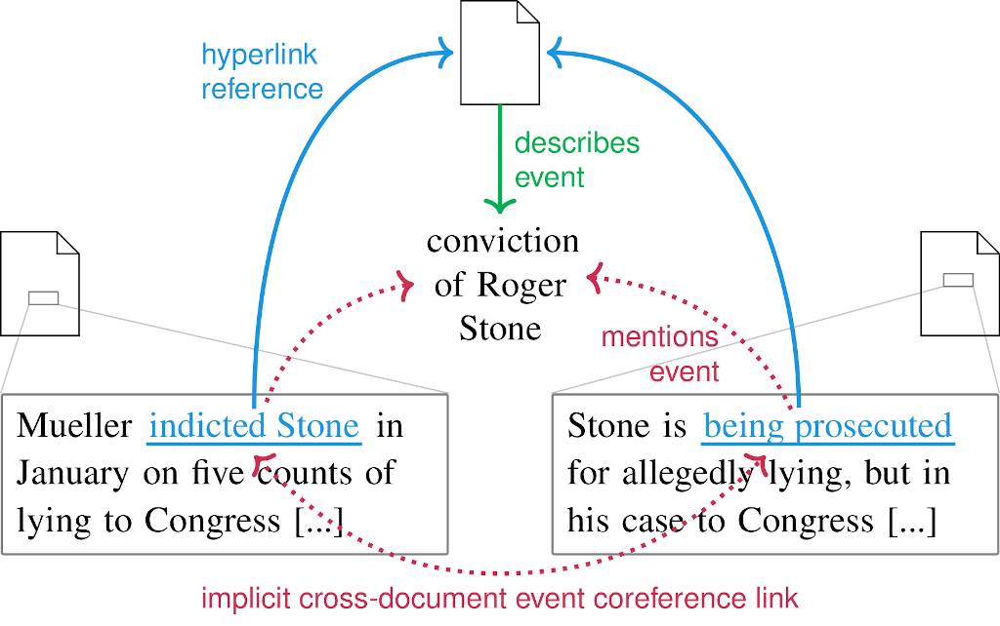

# Event Coreference Data (Almost) for Free: Mining Hyperlinks from Online News


This repository accompanies our paper *Event Coreference Data (Almost) for Free: Mining Hyperlinks from Online News* [published at EMNLP 2021](https://aclanthology.org/2021.emnlp-main.38/).

It contains:
- code for (re-)creating the HyperCoref corpus
- 🚧🚧 tba 🚧🚧 the cross-document event coreference resolution (CDCR) system implementation used in our experiments, which is a modified version of [Cattan et al. 2021's system](https://github.com/ariecattan/coref/)
- 🚧🚧 tba 🚧🚧 [CoNLL files and scores from our experiments](archive/)

Please cite our work as follows:
```
@inproceedings{bugert2021event,
    title = {{Event Coreference Data (Almost) for Free: Mining Hyperlinks from Online News}},
    author = "Bugert, Michael and Gurevych, Iryna",
    booktitle = "Proceedings of the 2021 Conference on Empirical Methods in Natural Language Processing",
    month = {11},
    year = "2021",
    address = "Online and Punta Cana, Dominican Republic",
    publisher = "Association for Computational Linguistics",
    url = "https://aclanthology.org/2021.emnlp-main.38",
    doi = "10.18653/v1/2021.emnlp-main.38",
    pages = "471--491",
}
```

> **Abstract:** Cross-document event coreference resolution (CDCR) is the task of identifying which event mentions refer to the same events throughout a collection of documents. Annotating CDCR data is an arduous and expensive process, explaining why existing corpora are small and lack domain coverage. To overcome this bottleneck, we automatically extract event coreference data from hyperlinks in online news: When referring to a significant real-world event, writers often add a hyperlink to another article covering this event. We demonstrate that collecting hyperlinks which point to the same article(s) produces extensive and high-quality CDCR data and create a corpus of 2M documents and 2.7M silver-standard event mentions called HyperCoref. We evaluate a state-of-the-art system on three CDCR corpora and find that models trained on small subsets of HyperCoref are highly competitive, with performance similar to models trained on gold-standard data. With our work, we free CDCR research from depending on costly human-annotated training data and open up possibilities for research beyond English CDCR, as our data extraction approach can be easily adapted to other languages.

Contact person: Michael Bugert

https://ukp.tu-darmstadt.de

https://tu-darmstadt.de

> This repository contains experimental software and is published for the sole purpose of giving additional background details on the respective publication.


## Content
The code base of our paper is split across three python projects:

1. [hypercoref/](hypercoref/): Data pipeline for (re-)creating the HyperCoref corpus. It outputs a collection of [Apache parquet](https://parquet.apache.org/) files.
2. [The "hypercoref" branch in another project of ours](https://github.com/UKPLab/cdcr-beyond-corpus-tailored/tree/hypercoref): Another data pipeline which shortens hyperlink anchor texts, and exports the data in a format friendly for CDCR systems.
3. 🚧🚧 tba 🚧🚧 [system/](system/): modified version of [Cattan et al. 2021's CDCR system](https://github.com/ariecattan/coref/) which can be trained/tested on corpora other than ECB+.
