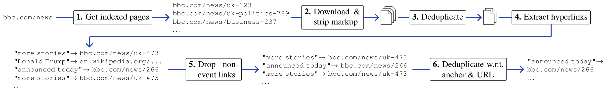

# HyperCoref setup
For legal reasons, we cannot distribute the HyperCoref corpus directly. We instead release the full implementation of our data pipeline so that anyone wanting to use HyperCoref can recreate a closely matching version from raw CommonCrawl responses themselves.

## Recommended system specs
We recommend using a machine with:
* 16 logical CPU cores
* 64GB of RAM
* 500GB of free disk space
* installed [Docker](https://docs.docker.com/engine/install/) and [docker-compose](https://docs.docker.com/compose/install/)

**Neither of these are hard requirements.** Fewer CPU cores will make it run more slowly. Less than 64GB RAM is fine, but extracting the largest news outlets will either fail with OOM or will require a large enough swap partition. Docker is optional as well (we didn't use it for creating the corpus), but it is the fastest way to get started.

## Docker preparation
1. Clone this git repository.
2. Inside the `.env` file, specify the location the resulting corpus will be written to on the host system (default: `~/hypercoref`).
3. Run `docker-compose up -d` in the folder containing this readme. Apart from spawning a CoreNLP service, this spawns a container called `hypercoref-pipeline` in which our scripts are meant to be run:
    * Attach to the interactive shell in this container by running `docker attach hypercoref-pipeline`.
    * To detach it (without stopping the container), press `Ctrl+p, Ctrl+q` in sequence.

## Recreating HyperCoref


To recreate the corpus, we start from a list of deduplicated Common Crawl URLs, meaning we start the pipeline roughly between stages 2 and 4 (in practice, there are more stages than shown above).

First, get [our full set of deduplicated URLs for all news outlets](https://tudatalib.ulb.tu-darmstadt.de/handle/tudatalib/3390) by running (inside the `hypercoref-pipeline` container) `/hypercoref/resources/scripts/docker_get_seed_data.sh`

### Trial run (1 small news outlet)
We recommend to try out the data pipeline with a small news outlet first. Run:
```bash
python3 run_pipeline.py run \
  resources/yaml/device_docker.yaml \
  resources/yaml/article_extraction/base.yaml \
  resources/yaml/article_extraction/english/wired.com.yaml
```
Completion takes roughly 30 minutes on a workstation with 4 logical CPU cores.
Afterwards, the folder `article_extraction_wired.com` (at `/hypercoref/working_dir/` inside the container, and in your host location specified earlier) will contain the output from each pipeline stage, with `7_CreateSplitsStage_create_splits` containing the files for each split. These can be used like so:
```python3
>>> import pandas as pd
>>> hyperlinks = pd.read_parquet("~/hypercoref/.../hyperlinks.parquet")
>>> hyperlinks
                                                 to-url  sentence-idx  ...                                  to-url-normalized token-idx-from  token-idx-to
1496  https://www.wired.com/story/melinda-gates-tech...            28  ...  wired.com/story/melinda-gates-tech-women-empow...             15            22
1401  https://www.wired.com/2016/01/obamas-anti-canc...            43  ...  wired.com/2016/01/obamas-anti-cancer-moonshot-...             23            25
...
```

### Full run (all news outlets)
Run `resources/scripts/create_all.sh` in the docker container to extract all 40 news outlets, starting with the smallest ones.

> Note: Due to the large amount of data involved and the complexity of all steps performed, there is a good chance that the script does not complete successfully for all news outlets. Common gotchas are insufficient disk space, insufficient main memory, and being throttled by CommonCrawl (when using many CPU cores paired with too short waiting times between requests). We recommend starting news outlets one by one instead, keeping track of how far the pipeline of each news outlet has progressed, and resuming failed pipelines where necessary (see below). Overall, expect 7-14 days of script runtime to obtain all corpora.  


## Advanced

### Resuming a failed pipeline
Steps (explanation below):
1. `cp resources/yaml/article_extraction/base.yaml resources/yaml/article_extraction/my_failed_outlet.yaml`
2. Comment out all successfully completed stages at the top of `resources/yaml/article_extraction/my_failed_outlet.yaml`.
3. Find the python source of the failed pipeline stage inside [python/data/pipeline](python/data/pipeline), and look for the `requires_files` method to find out which kind of files that stage requires as input (typically, it's one or more of `page_index`, `page_infos`, `sentences`, `tokens` or `hyperlinks`).
4. Explore `/hypercoref/working_dir/...` and check the folder(s) of the last successfully completed pipeline stage(s) for files corresponding to what you saw in step 3. Edit `resources/yaml/article_extraction/english/my_failed_outlet.tld.yaml` and fill in the files to those paths under `files_produced`.
5. Resume the pipeline via
   ```bash
   python3 run_pipeline.py run \
     resources/yaml/device_docker.yaml \
     resources/yaml/article_extraction/my_failed_outlet.yaml \
     resources/yaml/article_extraction/english/my_failed_outlet.tld.yaml
   ```

#### Explanation

In our data pipeline implementation, each pipeline stage requires certain files as input (`files_produced` method), and produces other files as its output (`files_produced` method). Using a [DummyFeederStage](python/pipeline/common/dummy_feeder_stage.py), one can manually feed files into a pipeline. This stage is already being used to specify the correct CSV file with CommonCrawl URLs for each news outlet (see the contents of `resources/yaml/article_extraction/english`), so it is easiest to modify config files of affected news outlets.

> Note: Operations within a pipeline stage cannot be resumed.

If you struggle with failing `WarcExtractionStage`s or `TokenizeStage`s and have a fast storage and several extra TB of space available, caching CoreNLP responses might pay off when resuming frequently. To enable this, manually set `use_cache=True` in [hyperlink_content_extractor.py](python/data/pipeline/warc_extraction/hyperlink_content_extractor.py) and [tokenize.py](python/data/pipeline/postprocessing/tokenize.py).

### Reducing/increasing the CommonCrawl request rate
At the risk of being throttled or temporarily anned by CommonCrawl, you can reduce the time between each thread's HTTP request with the `wait_between_requests_seconds` parameter in `resources/yaml/article_extraction/base.yaml`. When the request rate is too high, usually a flurry of exceptions is printed where each ends with `'Could not obtain [article URL] from [CommonCrawl URL].' Arguments: (ArchiveLoadFailed('Unknown archive format, first line: [\'<?xml\', \'version="1.0"\', \'encoding="UTF-8"?>\']'),)`. (The XML informs you to "Please reduce your request rate.").

Note that this waiting time is applied per thread (== per logical CPU), i.e. with 16 threads and 150ms waiting time, a request will be fired every 9ms on average.

### Reducing the number of threads
Set `max_cores` in `resources/yaml/device_docker.yaml`. 

### Slurm
Users of [Slurm](https://slurm.schedmd.com/) might consider reusing [our job submission scripts](resources/slurm).
* CoreNLP was run as a separate job. The job script checks every 23h for any job in the queue whose name contains "needs_corenlp", and reschedules itself in that case.
* Corpus creation was set up as a job array, where the job array index indexes into the folder with YAML configuration files in lexicographic order (index 0 = first file, etc.).
* The number of threads to use is configured based on the job definition, see `set_up_dir_structure` in [config.py](python/util/config.py).

### Extracting custom/new data
Extracting custom data based on more recent crawls (or other languages, etc.), requires several extra steps:

1. Prior to running the pipeline as described above, one first needs to retrieve all page URLs from the Common Crawl index which match a certain domain prefix (we refer to as "page seeding" in the code). Using trial data:
   ```bash
   python3 run_pipeline.py run \
     resources/yaml/device_docker.yaml \
     resources/yaml/page_seeding/page_seeding_trial.yaml
   ```
   This takes roughly 30 minutes to complete (10 minutes when executing it a second time, due to cached Common Crawl responses). Afterwards, the file `commoncrawl_cdx_deduplicated.csv` (several folders deep inside `page_seeding_trial` in the working directory) will contain the resulting list of URLs needed for the next data extraction step.

   Our full HyperCoref page seeding configuration can be found in `resources/yaml/page_seeding/page_seeding.yaml`. This file also contains the page seeding configuration for the German, French and Dutch news outlets we experimented with.
2. Copy an existing news outlet configuration (`cp resources/yaml/article_extraction/english/wired.com.yaml resources/yaml/article_extraction/english/my_custom_outlet.tld.yaml`). In the new file, replace the value of `page_index` with the path to the `commoncrawl_cdx_deduplicated.csv` file created in step 1.
3. Create a copy of `resources/yaml/article_extraction/base.yaml` and at the top, comment back in the three pipeline stages. These perform further filtering on the page index file, retrieve all pages, and perform content-based deduplication. The refined page index CSV file produced by the deduplication stage is the one we provide for each news outlet for recreating the corpus (see above).
4. Run the pipeline
   ```bash
   python3 run_pipeline.py run \
     resources/yaml/device_docker.yaml \
     resources/yaml/article_extraction/custom.yaml \
     resources/yaml/article_extraction/my_custom_outlet.tld.yaml
   ```

> Note: Depending on the size of your page index created in step 1, completing the first `warc_extraction` pipeline stage can take several days. Also, note that the second `warc_extraction` stage will redownload all pages that made it through the content deduplication stage. There is no good reason for this, other than the code having grown historically.